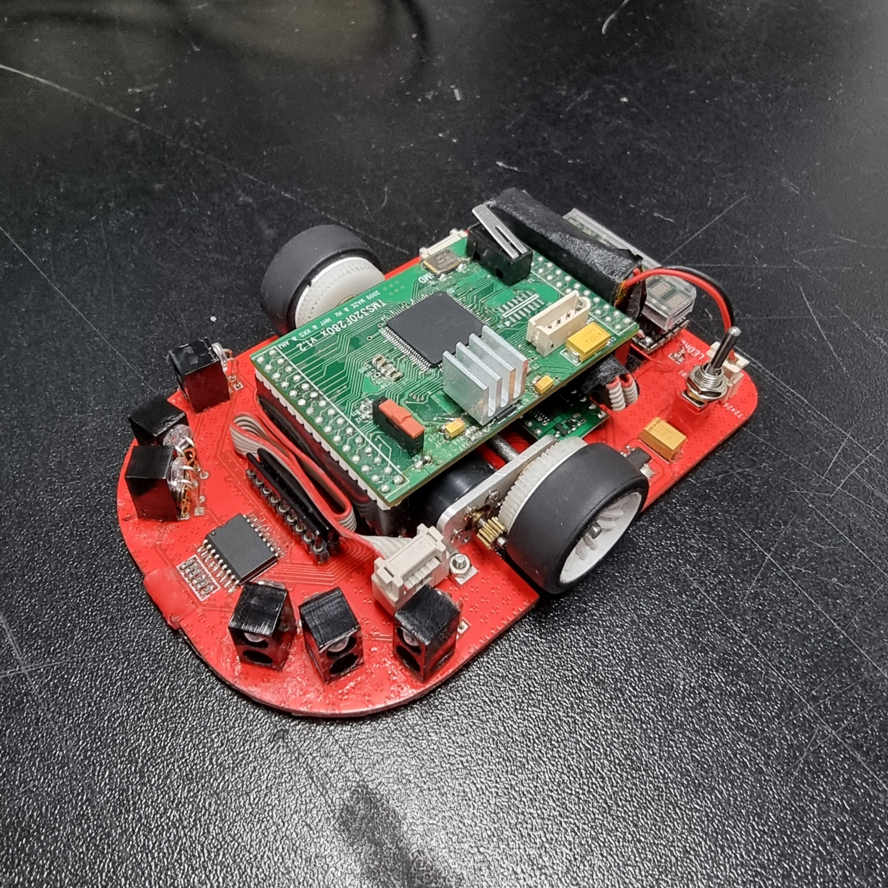
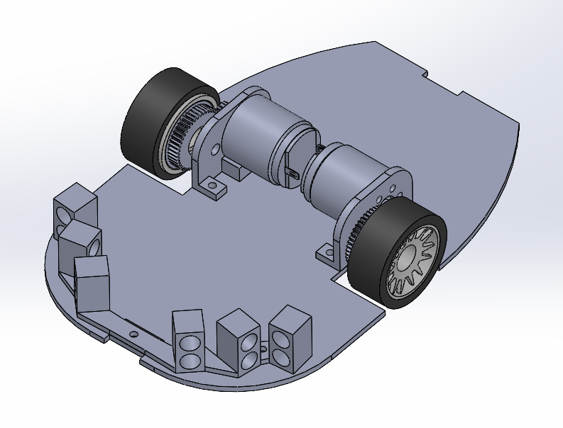

<p align="center">
  
  
  
  
</p>

## 🚀 Project Overview
**MicroMouse** is an autonomous maze-solving robot featuring high-precision PID control for center-position tracking. This project encompasses custom hardware design, pathfinding algorithms, and a real-time firmware architecture optimized for the **TI TMS320F2809** DSP.

---

## 📸 Technical Showcase
<p align="center">
  
  
  <br>
  <em>Real Robot Performance & SolidWorks 3D Modeling</em>
</p>

---

## 🛠 Hardware Specifications
### 🏗 Mechanical & Body
- **PCB Design**: Custom Integrated Design using **PADS** & **EasyEDA**
- **3D Modeling**: Precision parts designed in **SolidWorks** (Motor/Sensor guards)

### 🏎 Actuator & Drive
- **Motor**: **Faulhaber 1717 006SR** + Encoder
- **Gear Ratio**: 3:1 Mechanical Optimization

### 📡 Sensors & Controller
- **MCU**: **Texas Instruments TMS320F2809** (DSP)
- **Gyro**: **ENC-03RC** (1-Axis Gyro for angular velocity compensation)
- **IR Sensors**: **SI5312-H** (Emitter) & **ST1KLA** (Photo Transistor) pairs

---

## ✨ Key Features
- 🎯 **Advanced Control**: Constant center-position tracking and velocity profiles using PID.
- 🗺 **Maze Solving**: Implements Weighted Search & FloodFill algorithms for shortest path discovery.
- 🔄 **Motion Profiles**: Smooth Turn at high speeds and Diagonal (45/135 deg) navigation.
- 💻 **Development Environment**: Code written in **Source Insight** and compiled via **TI cl2000**.

---

## 📂 Project Structure
```text
.
├── main/                       # Core Software & Firmware Logic
│   ├── main.c                  # Main execution loop & system initialization
│   ├── algo.c                  # Maze navigation & pathfinding (FloodFill/Weighted)
│   ├── sensor.c                # IR & Gyro sensor data acquisition/processing
│   ├── Motor.c                 # PID control laws & Motor driver orchestration
│   ├── DSP280x_Spi.c           # SPI communication for ROM & Upload interface
│   ├── Menu.c                  # On-device menu system for parameter tuning
│   ├── MAKEFILE                # Hardware-specific compilation rules
│   └── build_Bat.bat           # Automated build script for Windows/cl2000
├── include/                    # Global header files & IQmath Fixed-point library
├── Compiler/                   # TI cl2000 Compiler toolchain (bin, lib, include)
└── README.md                   # Project documentation
```

---

## 🛠 Build & Installation
### 1. Compilation
The firmware is compiled using the **Texas Instruments cl2000** compiler.
- Navigate to the `main` directory and run the build script:
  ```bash
  .\build_Bat.bat
  ```
- This triggers `cl2000.exe` via the Makefile to generate optimized hexadecimal files (`.hex`) and output binaries (`.out`).

### 2. Firmware Upload
The firmware is uploaded via **SPI (Serial Peripheral Interface)** using a **MAX232** level shifter for reliable data transmission from the PC.
- Hexadecimal files are transferred through the SPI interface as implemented in `DSP280x_Spi.c`.
- The **MAX232** chip converts RS-232 signals to TTL levels compatible with the DSP.

---

## 🏆 Awards
- 🥇 **2025 지능형 로봇 경진대회** - **대상** (Grand Prize)
- 🥇 **2024 지능형 로봇 경진대회** - **대상** (Grand Prize)
- 🥇 **The 45th All Japan Micromouse Contest** - **1st Prize (Freshman Class)**

---
